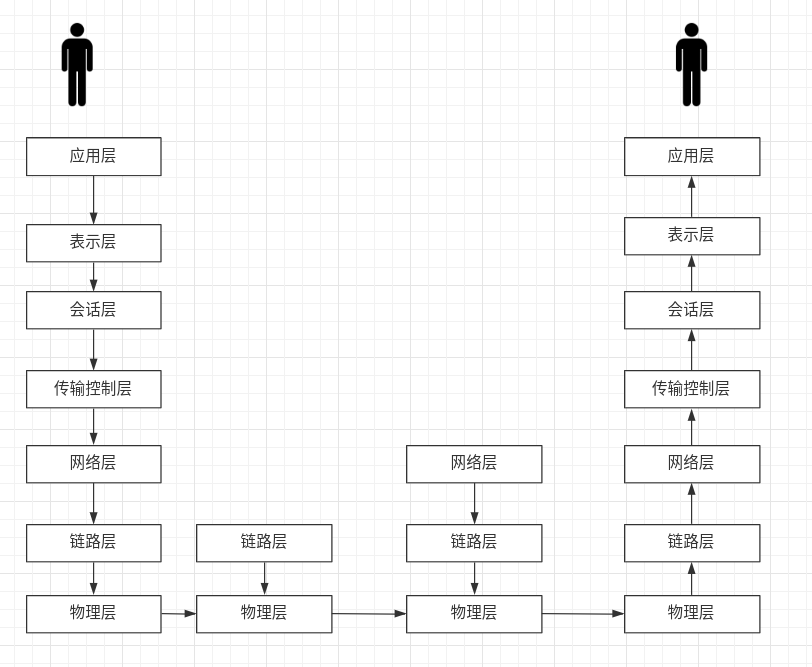
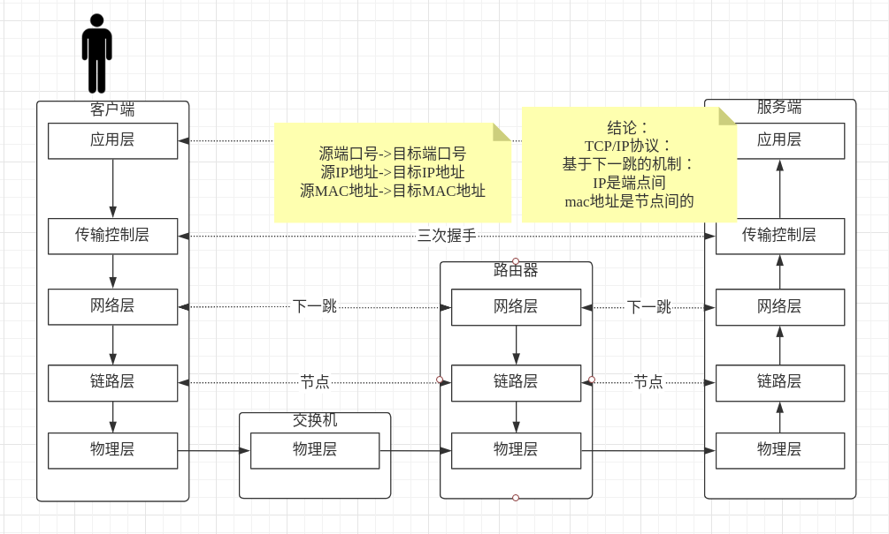
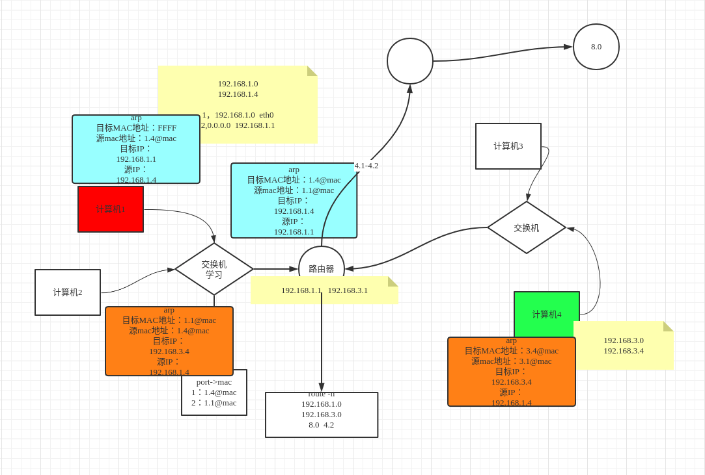

# 3.网络OSI

## 一．通信模型流程

## 1.OSI参考模型

## 2.tcp/ip五层模型

**三次握手**

​		 1.A->B(A向B发送连接请求)

​		 2.A<-B(B应答A发送一个ok请求)

​		3.A->B(A向B发送确认连接请求并建立连接)

**四次分手**

​		1.A->B(A向B发送断开连接请求)

　　2.A<-B(B应答A发送一个ok请求)

​	    3.B->A(B向A发送断开连接请求)

​        4.B<-A(B收到Ａ应答,并断开链接．需要双方知晓并回应才可以断开链接)

**三次握手>数据传输>四次分手，成为一个最小粒度，不可被分割**

## 3.linux命令验证

cd /proc/$$/fd

exec 8<> /dev/tcp/www.baidu.com/80		//建立连接

echo -e 'GET/HTTP/1.0\n'							 //传送数据（http：规范标准）

cat <& 8														　//最终演示的是一个应用层协议

##  4.下一调机制

**交换机**连接同一个局域网计算机，**路由器**连接不同网络的计算机

传输层：

netstat -natp			//查看本机ip:port与外围　ip:prot　通信列表

​		一台计算机最多可以有65535个端口哦,握手确定连接后,两边都会随机产生一个发送端口

网络层：

route -n 					//查看ip路由表

**创建路由**

​			在A（192.168.150.13）创建一个网卡，在局域网B机器ping通

​			在Ａ创建：ifconfig eth0:3 192.168.88.88/24

​            在Ｂ创建路由：route add -host 192.168.88.88 gw 192.168.150.13

​			现在就可以在B机器ping通Ａ机器192.168.88.88了

链路层：

arp -an						//mac地址

**arp流程**:

​          刚启动计算机，arp表是空的，刚通电网卡发送　FFFFFFFF（路由器接受并反回），本机学习到网卡ip@mac
