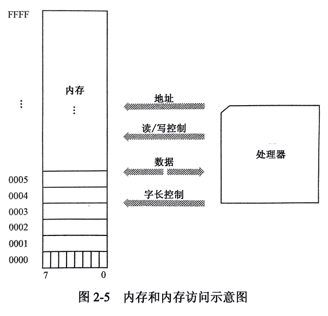
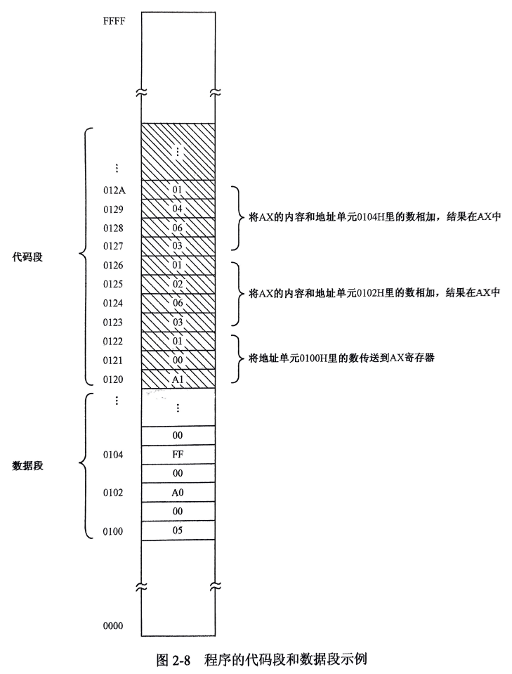
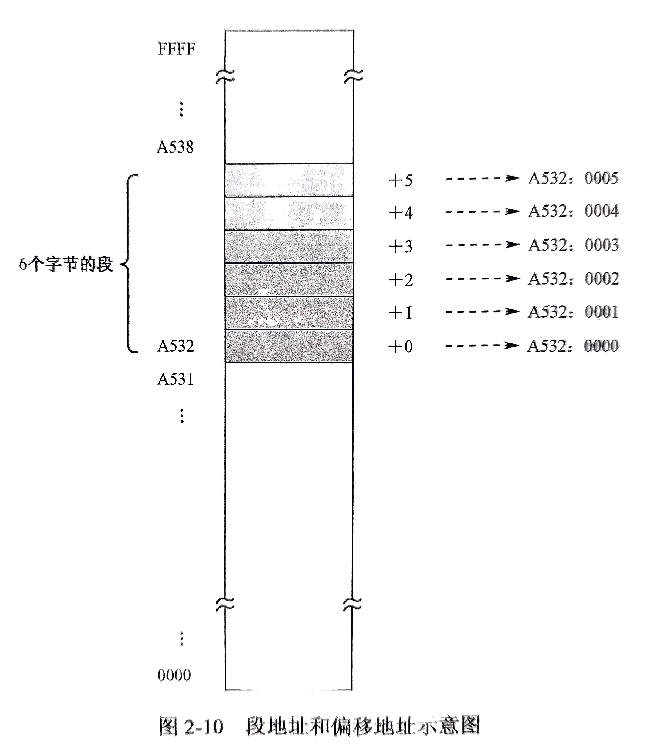
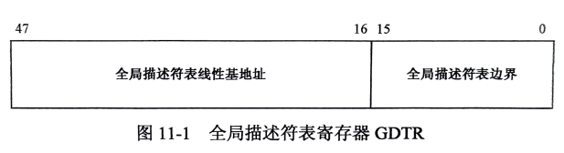
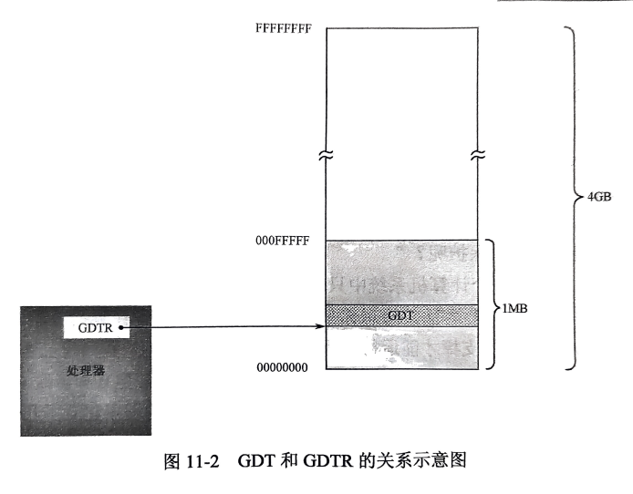
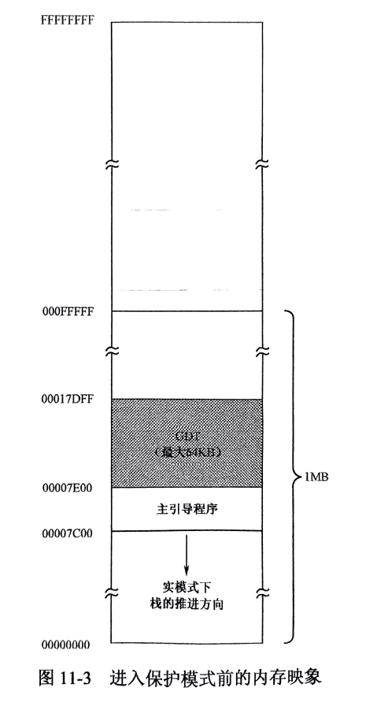
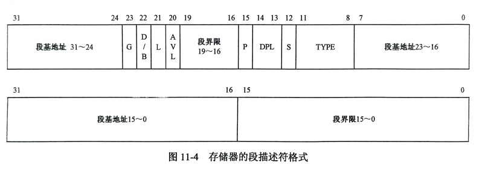

## 8086实模式到保护模式

```
	8位处理器包含8位寄存器和算术部件，16位处理器包含16位寄存器和算术部件，32位处理器包含32位寄存器和算术部件...。
	8086是16位处理器，本文基于8086处理器来讲，基于兼容性不管是32位，64位处理器都兼容8086处理指令。
```

一。cpu的执行

二。实模式下执行

三。Bochs调试

四。保护模式(与实模式区别)

五。常用语法及指令

#### 一。cpu的执行

```
1.内存的访问
	见[图2.1]
	1）8086提供20位地址线，16位寄存器，16位物理地址只能访问64KB内存(0000F~FFFFH)（为什么不是20位寄存器？？？）。
	2）而20位的物理地址可用访问多达1M的内存（00000H~FFFFFH），16位段地址和16位偏移地址相加怎么得到20位地址？
	3）为了解决上面问题，8086处理器形成时，先将段寄存器内容左移4位（相当于乘以十六进制的10，或十六进制的16），形成20位的段地址，然后同16位的偏移地址相加得到20位的物理地址。
```
图2.1


2.指令的执行

```
2.指令的执行
	见[图2.2]
	1）指令组成
	指令 = 操作码 + 操作数
	* 内存中，指令 与 数据存储是分开的，就形成了代码段(指定某个地址起始)与数据段(指定某个地址起始)。
		严格来说数据段和代码段是不需要连续的，但图中把他们挨在一起更自然
	* 16位的8086处理器能访问1M空间，能分成65536个段，段地址可以自由划分，但必须是（起始地址16字节对齐）
	2）8086低端字节序及指令执行流程
	高字节位存高地址部分，低字节位存低地址部分，这称为“低端字节序”，这是Intel处理器，其它公司处理器可能相反。这种关系与处理器与内存之间的数据线连接方式有关。
	如：图中第一条指令A1 00 01 ，将内存单元0100H里的字传送到AX寄存器，执行完后AX寄存器内容为0005H
	   指令 A1(是操作码)+(00[低位]+01[高位])(操作数)，按照“高字节位存高地址部分，低字节位存低地址部分”，组合起来就是将内存单元 01nasm_os.vhd00H 里面的字传送到AX寄存器，数据段地址0100H内容是0005H，所以AX内容也是0005H。
	   操作码隐含了一些信息，包含每条指令长度，第一条指令执行完后就知道第二条指地址（当前指令地址+指令长度）就是下一个要执行的指令地址
```
图2.2


3.内存的分段
```
3.内存的分段
	见[图2.3]
	1）重定位问题，在指令中不能使用绝对内存地址(物理地址)，这样是无法重定位的。因为大多数情况，整个程序内存中的位置并不是我们能够指定的，所以不能直接使用物理地址。
	2）为了解决上面问题，在硬件这一层提供“段地址：偏移地址”内存访问支持，处理器至少要提供两个段寄存器如下
	cs--->代码段（可指定）,ds--->数据段(可指定)
	3) 8086内部有4个段寄存器(还有8个16位通用寄存器)
	cs--->代码段（可指定）
	ds--->数据段(可指定)
	es--->附加段寄存器(可指定)
	ss--->栈段寄存器(非常重要)
	还有ip--->指令指针寄存器(不可指定，一般配合cs)
```
图2.3


4.内存空间分配
```
4.内存空间分配
	见[图2.4]？？？,34页
	1）cpu上电启动与复位
	在众多处理器引脚中，有一个是RESET,用于接受复位信号。当RESET由低变成高电频时，处理器会执行一个硬件初始化，以及一个可选的内部测试，然后内部所有寄存器初始到一个预置的状态。
	对8086来说，RESET复位后，CS内容为0xFFFF,其它所有寄存器都为0x0000,包括ip指针。
	但8086之后的处理器并未延续这种设计，毫无疑问这都是有目的的
	2）8086能访问1M（0x00000~oxFFFFF）,并非全部用来访问内存(DRAM).
	大部分用来访问内存(DRAM),剩余留给只读存储器ROM与外围的板卡
	3）硬盘及工作原理
	软盘相似设备是硬盘(Hard Disk,HDD),硬盘外面是一个铝合金外壳，里面可用有多个盘片，中间有个高速转动的马达，每个盘片上下两个磁头及盘面，每个盘面一圈为一个磁道，每个磁道又有63个(通常)扇区。
	如果一个硬盘有多个盘面，存数据时，是当a,b,c。。。面所有0磁道都用完后，才移动磁头1磁道继续使用的，这个是为了减少磁头的移动次数，提高存储速度。
	4）一切从主引导扇区开始
	磁盘第一个扇区是0面，0道，1扇区(扇区从1开始)，如果计算机设置是从硬盘启动，那么,ROM-BIOS将读取硬盘主引导扇区的内容，将它加载到内存地址0x0000:0x7c00处（也就是物理地址0x07c00）,然后用一个jmp指令调到那里接着执行。
	jmp 0x0000:0x7c00
	为什么偏偏是0x7c00这个地方？还不太清楚，当时定这个方案的家伙已经被人说了很多坏话。
	5）硬盘模式介绍
	访问硬盘有2中方式，最早是CHS模式（使用磁头，磁道，扇区这种方式访问），但很不方便。
	还一种方式是LBA（逻辑快地址）模式，在硬件一级提供支持，现在无论哪个厂家都支持LBA模式，效率高，兼容性好。
	比如：逻辑0扇区对应 = 0面，0道，1扇区，
		 逻辑1扇区对应 = 0面，0道，2扇区
		 ......
		 计算方法
		 LBA = C x 磁头总数 x 每道扇区数 + H x 每道扇区数+（S-1）
```
图2.4


#### 二。实模式下执行

```
1.工具安装
	1）nasm（8086汇编工具）
		nasm官网：https://www.nasm.us
		提供linux,mac,windows多平台
		* linux平台编译安装
		$ ./configure --prefix=/home/ubuntu-a10/Desktop/soft/dev/nasm
		& make install
	2）VirtualBox安装
		。。。
	3）写入工具(开源)
		* fixed-vhd-writer
			https://github.com/AloneCafe/fixed-vhd-writer
			https://gitee.com/liyuan3210/fixed-vhd-writer.git
			只能windows可以正常写入，linux下gcc编译writer.c有问题
		* fixed-vhd-writer-python
			https://github.com/fujiawei-dev/fixed-vhd-writer
			https://gitee.com/liyuan3210/fixed-vhd-writer-python.git
			需要安装python环境，linux，windows都可以使用
			安装：
			$ pip install -U fixed-vhd-writer
			写入扇区：
			$ vhdwriter -v nasm_os.vhd -b 4-2.bin -o 0
		
2.代码编写及编译
	* 编写 代码4-2.asm
	* 编译代码
	$ nasm -f bin 4-2.asm -o 4-2.bin
	
3.vhd虚拟磁盘扇区写入
	* VirtualBox创建一个虚拟机，虚拟磁盘创建配置成VHD格式并且是固定大小的，创建的虚拟机下面会生成一个nasm_os.vhd文件
	* 写入命令
	$ vhdwriter -v nasm_os.vhd -b 4-2.bin -o 0
	* 查看.vhd磁盘信息
	$ vhdwriter -v nasm-os.vhd -s true
	
4.验证
	启动虚拟机，黑屏幕左上角显示“asm”，至此整个环境已可用在实模式下运行。
	
	
笔记问题：
	fixed-vhd-writer编译问题：
		https://www.codenong.com/cs107121403/
	npp导入hex插件：
		https://blog.csdn.net/wkd_007/article/details/128193482
	windows运行库下载
		https://blog.csdn.net/qq_37003559/article/details/122828051
    	https://learn.microsoft.com/zh-cn/cpp/windows/latest-supported-vc-redist?view=msvc-170
```
代码4-2.asm
```assembly
start:
	mov ax,0xb800
	mov ds,ax
	mov byte [0x00],'a'
	mov byte [0x02],'s'
	mov byte [0x04],'m'
	jmp $
	
current:
	times 510-(current-start) db 0
	
	db 0x55, 0xaa
```

#### 三。Bochs调试

1.windows下安装

```
运行与配置
```

2.linux下安装

```
* apt安装
$ apt-get install bochs
问题Message: dlopen failed for module 'x' (libbx_x.so): file not found
$ apt-get install bochs-x
1）保存文件x.bxrc
2）加载文件x.bxrc

* 源码安装
$ cd ~/Downloads/bochs-2.6.11
$ sudo apt-get install libgtk2.0-dev
$ ./configure --enable-debugger --enable-disasm
$ make all
$ sudo make install
```

* 在线指令文档

  http://www.bytekits.com/bochs/bochs-intro.html

* img文件创建
    https://blog.51cto.com/u_15127673/4544902
    https://blog.csdn.net/weixin_49635198/article/details/126831887

3.常用调试命令

```
1.从物理地址0x7c00开始显示512字节的内存数据
$ xp /512xb 0x7c00
x：以十六进制显示
b: 以字节为单位显示

2.在物理地址0x7c00处设置断点
$ b 0x7c00
查看断点
$ info b

3.连续执行
$ c
再次查看
$ xp /512xb 0x7c00

4.单步执行
$ s

5.查看显存
$ xp /16xb 0xb800
单步执行,与s相似(查看显存)
$ n

6.返回将要执行的机器指令
$ u 反回一条
$ u /16 返回16条指令
可以查看物理地址，并设置断点
$ b (看到的物理地址)

7.通用寄存器，断寄存器，标识寄存器查看
* 通用寄存器
	$ r 或 reg
* 段寄存器
	$ sreg
* 标志寄存器
	$ info eflags
补充：
	1）全局描述符查看
		$ info gdt
	2）任务状态段查看
		$ info tss
	3）中断描述符查看
		$ info idt

8.help帮助，查看更多命令
```

#### 四。保护模式(与实模式区别)


```
	在实模式下，用户程序可以随意修改不属于自己程序的内存，这样如果是操作系统所在位置，就很容易导致系统奔溃或出现问题，所以在80286以后在处理器这一层都支持保护模式。

* 8086只有实模式，20根物理地址线，能访问1m内存
* 80286可运行在实模式，保护模式，24根物理地址线，能访问16M内存
* 80386以及后续32位处理器都兼容实模式，可运行保护模式下，32根物理地址线。能访问4G内存

V86模式：
   除了保护模式，32位处理器还提供虚拟8086模式（V86模式），这中模式下IA-32处理器被模拟成多个8086处理器并行工作。V86模式是保护模式的一种，可在保护模式下执行多个8086程序（传统要执行8086程序，处理器要工作在实模式），V86模式提供了他们在一起运行的条件。
```
#### [进入保护模式代码](protect_code.md)

1.分段机制（保护模式）

```
* 全局描述符表寄存器GDTR
	见[图11.1]
	
	寄存器GDTR,分两部分，分别是32位的线性地址，和16位的边界
	
* GDT和GDTR的关系图
	见[图11.2]
	
* 进入保护模式前的内存映像
	见[图11.3]
	* 实模式下只能访问1m内存，故GDT通常定义在1m以下内存范围。当然运行在进入保护模式后可以换个位置重新定义GDT
	* 上图把GDT设置在引导程序之后，也就是0x7c00
	
* 存储器的段描述符格式
	见[图11.4]
	
	每个描述符在GDT中占8字节，也就是2个双字，或者是64位。
	
```
图11.1


图11.2


图11.3


图11.4



2.分页机制(开启)

```
   在分段模型下，内存分配是不定长的，时间长了，内存空间就会碎片化。就可能出现一种情况，内存空间是有的，但都是小块，无法分配给需要连续大内存的任务，至此，为了解决这个问题，出现了分页机制。
   
```

#### 五。常用语法及指令

```
1。引导扇区代码

2.寄存器


```